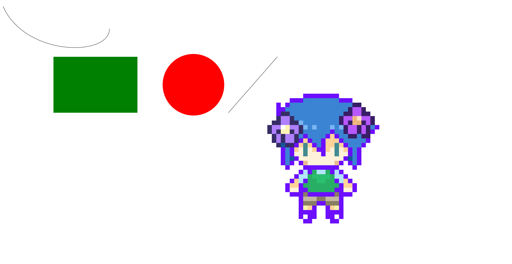

# atvcanvas
## Atividade de DJW sobre o canvas
  Essa foi uma atividade passada em aula para treinar o uso do canvas no JavaScript, onde foi solitado para ser desenhado um retangulo, um circulo, uma linha, uma curva e por fim uma imagem.
## Estrutura do projeto
 O projeto é composto pelas seguintes pastas
  * atvcanvas.html-Página inicial do site
  * js/index.js-Arquivo JavaScript
  * img/-Pasta com imagem utilizada na página
##desenvolvimeto
Para fazer essa atividade, foram utilizados essas etapas:
  1. Criar a estrutura básica do html:
   * Foi adicionado as tags html, head, title e body.
  2. adicionar a tag necessaria:
   * Foi adicionado a tag "canvas"
  3. Adicionar o JavaScript:
   * Foi adicionado o arquivo index.js para desenhar no canvas usando o JavaScript.
   
 Para desenhar as formas foram usados os seguintes passos 
 
   1. Foi selecionado o canvas a partir do se ID utilizando o getElementById e armazenado em uma const ctx com o contexto 2D. 
  * Retangulo:  
    * Para criar o retangulo foi adicionado um fillRect com as cordenardas de (200, 200, 300, 200), e um fillStyle para o pintar de verde. 
  * Circulo
    * Para criar o circulo foi adicionado um ctx.arc com as cordenadas (700, 300, 110, 0, Math.PI * 2) o Math.PI foi adicionado para definir um circulo completo, e um fill stile para o pintar de vermelho.
  * Linha:
    * Para criar uma linha foi adicionado um beginPath para iniciar o caminho do desenho e dois lineTo com as cordenadas (825,400) e (1000,200), e por fim foi colocado um stroke para desenhar oque foi definido no path.
  * Curva:
    * Para a criar a curva foi adicionado um beginPath para iniciar o caminho do desenho, um moveTo com as cordenadas(20, 20), e um bezierCurveTo com as cordenadas (100, 200, 400, 200, 400, 100) para desenhar a curva e por fim foi colocado um stroke para desenhar oque foi definido no path.
  * Imagem:
    *Para criar a imagem foi criada uma variavel img, e adicionado um Eventlisterner, e depois colocado um drawImage com as cordenadas (img,900,300) e por fim foi selecionada a imagem com o nome de "myImage.png" na pasta img
 * Imagem
 
 ## Autores 
 Gabriele e Arthur
 
